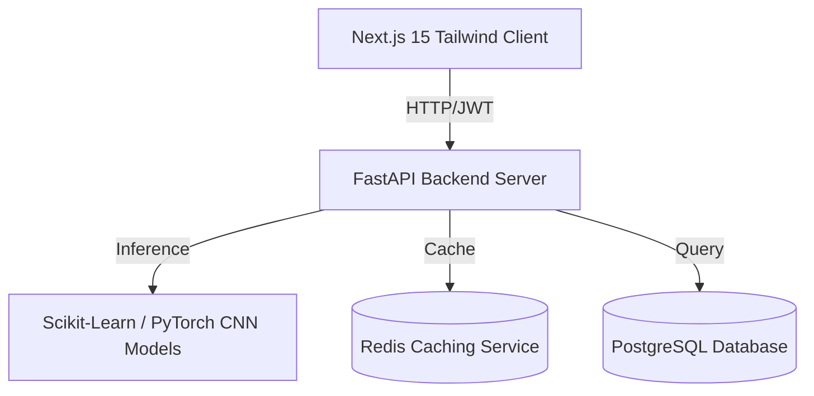

# OptiCrop – Smart Agricultural Production Optimization Engine

OptiCrop is a complete, production-ready SaaS application designed to help farmers, researchers, and policymakers optimize agricultural production using environmental and soil parameters. 

It predicts suitable crops, estimates expected yield, provides explainable AI (SHAP value feature attributions), conducts soil health assessments, coordinates weather intelligence with irrigation plans, and classifications leaf diseases using a PyTorch Convolutional Neural Network (CNN).

---

## 🏛️ System Architecture Topology

The application is structured into three main component layers:



* **Frontend**: Next.js 15 (TypeScript, Tailwind CSS, Framer Motion, Recharts, TanStack React Query).
* **Backend**: FastAPI, SQLAlchemy (declarative mapping, connection tests, automatic SQLite fallback).
* **Machine Learning**: Scikit-Learn (Random Forest classifiers/regressors), XGBoost, LightGBM, and PyTorch (Leaf Disease CNN).
* **Storage & Caching**: PostgreSQL, Redis (in-memory caching with transparent local memory dictionary fallback).

---

## ⚙️ Quick Start Installation Guide

### Option 1: Docker Compose (Fully Automated Production Setup)
Make sure you have Docker and Docker Compose installed, then execute:

```bash
docker-compose up --build
```
* **Frontend Panel**: `http://localhost:3000`
* **Backend Docs (Swagger)**: `http://localhost:8000/docs`
* **PostgreSQL Database Port**: `5432`
* **Redis Cache Port**: `6379`

### Option 2: Standalone Local Setup (Easy Dev/Testing)
This application includes automated fallback configurations. If PostgreSQL and Redis are not running, it automatically defaults to SQLite (`sqlite:///./opticrop.db`) and in-memory caches.

#### Step 1: Run the ML Pipelines
Ensure python libraries are installed, then run:
```bash
# 1. Install dependencies
pip install -r backend/requirements.txt

# 2. Generate datasets
python ml_pipeline/generate_datasets.py

# 3. Train all models
python ml_pipeline/train_crop_model.py
python ml_pipeline/train_yield_model.py
python ml_pipeline/train_disease_model.py

# 4. Package models inside backend folder
python ml_pipeline/copy_models.py
```

#### Step 2: Spin Up FastAPI Backend
```bash
# Run backend server
uvicorn backend.app.main:app --reload --port 8000
```
Swagger UI will be active at `http://localhost:8000/docs`.

#### Step 3: Run Next.js 15 Frontend
```bash
cd frontend
npm install
npm run dev
```
Open `http://localhost:3000` to interact with the SaaS control board.

---

## 🔑 Default Seed Credentials

Upon startup, the database auto-seeds three distinct roles:

| Role | Username / Email | Password |
| :--- | :--- | :--- |
| **Farmer** | `farmer@opticrop.com` | `farmer123` |
| **Researcher** | `researcher@opticrop.com` | `researcher123` |
| **Administrator** | `admin@opticrop.com` | `admin123` |

---

## 🧪 Running Automated Unit Tests

The backend includes a comprehensive test suite covering credentials, JWT validation, ML predictors, soil checkers, and CNN image classifications.

```bash
python -m pytest backend/tests/
```
All tests execute against isolated SQLite in-memory databases with connection pooling.
